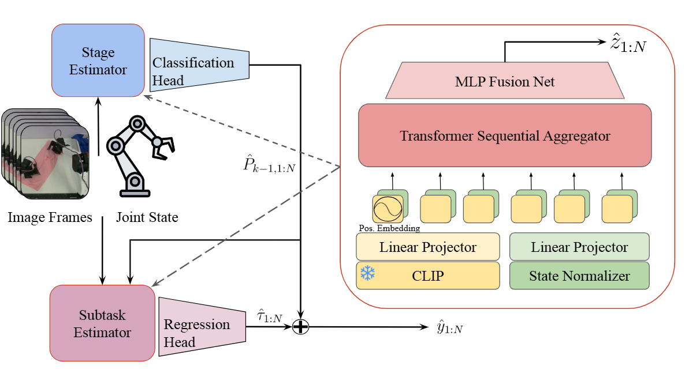

<div align="center">


# SARM: Stage-Aware Reward Modeling for Long Horizon Robot Manipulation


[Project Page](https://qianzhong-chen.github.io/sarm.github.io/)  | [Arxiv](https://arxiv.org/abs/2509.25358)

</div>

<div align="center">
  
</div>


This repository provides training and evaluation scripts for **SARM** on both the LeRobot dataset and raw robot trajectories.


## Configurations & Installation

We recommend using [uv](https://github.com/astral-sh/uv) for dependency management.  

### 1. Clone the repository:
```bash
git clone https://github.com/xdofai/opensarm
```

### 2. Install `uv`
```bash
pip install uv
```

### 3. Sync environment
```bash
uv sync
```

### 4. Activate environment
```bash
source .venv/bin/activate
```


## Reward Model Training

```bash
python train.py --config-name sarm
```


## Reward Model Evaluation

### Evaluate on LeRobot dataset's validation set
```bash
python eval.py --config-name sarm
```

### Evaluate on raw robot trajectory
```bash
python eval.py --config-name sarm --mode raw_data
```

---

## Notes
- Replace `sarm` with `rewind` in the commands above if you want to run the baseline method.  
- All configs are stored under the `config/` directory.

## Dataset Clarification
### We use a modified [LeRobotDataset](https://huggingface.co/docs/lerobot/en/lerobot-dataset-v3)  structure:
```bash
A typical LeRobotDataset looks like this from its root path:
        .
        ├── data
        │   ├── chunk-000
        │   │   ├── episode_000000.parquet
        │   │   ├── episode_000001.parquet
        │   │   ├── episode_000002.parquet
        │   │   └── ...
        │   ├── chunk-001
        │   │   ├── episode_001000.parquet
        │   │   ├── episode_001001.parquet
        │   │   ├── episode_001002.parquet
        │   │   └── ...
        │   └── ...
        ├── meta
        │   ├── episodes.jsonl
        │   ├── info.json
        │   ├── stats.json
        │   └── tasks.jsonl
        └── videos
            ├── chunk-000
            │   ├── left_camera-images-rgb
            │   │   ├── episode_000000.mp4
            │   │   ├── episode_000001.mp4
            │   │   ├── episode_000002.mp4
            │   │   └── ...
            |   ├── right_camera-images-rgb
            │   │   ├── episode_000000.mp4
            │   │   ├── episode_000001.mp4
            │   │   ├── episode_000002.mp4
            │   │   └── ...
            |   ├── top_camera-images-rgb
            │   │   ├── episode_000000.mp4
            │   │   ├── episode_000001.mp4
            │   │   ├── episode_000002.mp4
            │   │   └── ...
            ├── chunk-001
            └── ...
```
### Parquet schema (per timestep)

Each `episode_XXXXXX.parquet` stores a time-series trajectory.  
**Each row corresponds to one timestep** and contains the following columns:

| Column          | Type            | Shape | Dtype    | Description |
|----------------|-----------------|-------|----------|-------------|
| `state`        | `np.ndarray`    | (state_dim,) | float64  | Robot state vector at time *t*. |
| `actions`      | `np.ndarray`    | (act_dim,) | float64  | Action vector applied at time *t*. |
| `reward`       | `np.ndarray`    | (1,)  | float32  | Scalar **progress** at time *t*. |
| `timestamp`    | `np.ndarray`    | (1,)  | float64  | Timestamp (seconds). |
| `frame_index`  | `np.ndarray`    | (1,)  | int64    | Frame id in the video stream. |
| `episode_index`| `np.ndarray`    | (1,)  | int64    | Episode id (redundant but convenient for joins). |
| `index`        | `np.ndarray`    | (1,)  | int64    | Global step index (or row index). |
| `task_index`   | `np.ndarray`    | (1,)  | int64    | Task id (maps to `meta/tasks.jsonl`). |

**Note:** Despite its name, `reward` stores the absolute task progress (value) rather than a reinforcement learning reward.


## Acknowledgements
- The repository structure is adapted from [diffusion_policy](https://github.com/real-stanford/diffusion_policy).
- The dataset format follows the [LeRobotDataset](https://huggingface.co/docs/lerobot/en/lerobot-dataset-v3) specification.
- The *ReWiND* model included in this repository is our reproduction from the [paper](https://arxiv.org/abs/2505.10911); please refer to the official [**ReWiND**](https://github.com/rewind-reward/ReWiND) repository for the original implementation.


## Citation

If you find our paper or code is useful, please consider citing:
```kvk
@article{chen2025sarm,
  title={SARM: Stage-Aware Reward Modeling for Long Horizon Robot Manipulation},
  author={Chen, Qianzhong and Yu, Justin and Schwager, Mac and Abbeel, Pieter and Shentu, Yide and Wu, Philipp},
  journal={arXiv preprint arXiv:2509.25358},
  year={2025}
}
```