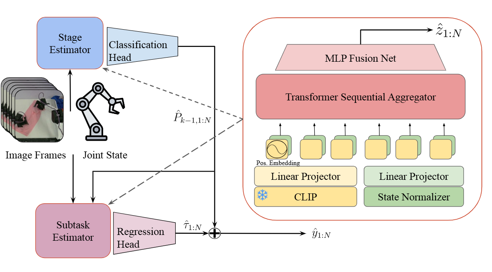

<div align="center">


# SARM: Stage-Aware Reward Modeling for Long Horizon Robot Manipulation


[Project Page](https://qianzhong-chen.github.io/sarm.github.io/)  | [Arxiv](https://arxiv.org/abs/2509.25358)

</div>

<div align="center">
  
</div>


This repository provides training and evaluation scripts for **SARM** on both the LeRobot dataset and raw robot trajectories.


## Configurations & Installation

We recommend using [uv](https://github.com/astral-sh/uv) for dependency management.  

### 1. Clone the repository:
```bash
git clone https://github.com/xdofai/opensarm
```

### 2. Install `uv`
```bash
pip install uv
```

### 3. Sync environment
```bash
uv sync
```

### 4. Activate environment
```bash
source .venv/bin/activate
```


## Reward Model Training

```bash
python train.py --config-name sarm
```


## Reward Model Evaluation

### Evaluate on LeRobot dataset's validation set
```bash
python eval.py --config-name sarm
```

### Evaluate on raw robot trajectory
```bash
python eval.py --config-name sarm --mode raw_data
```

---

## Notes
- Replace `sarm` with `rewind` in the commands above if you want to run the baseline method.  
- All configs are stored under the `config/` directory.

## Citation

If you find our paper or code is useful, please consider citing:
```kvk
@article{chen2025sarm,
  title={SARM: Stage-Aware Reward Modeling for Long Horizon Robot Manipulation},
  author={Chen, Qianzhong and Yu, Justin and Schwager, Mac and Abbeel, Pieter and Shentu, Yide and Wu, Philipp},
  journal={arXiv preprint arXiv:2509.25358},
  year={2025}
}
```